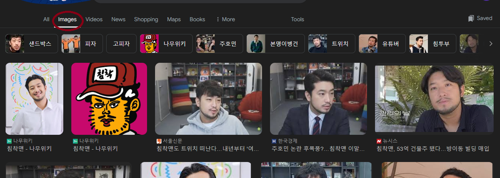

# 침착맨 푸다롱 분류

# 1. 크롤링

## 크롤링 전체 코드

```python
def download_images(save_dir, keyword, num_images):
    service = Service(ChromeDriverManager().install())
    driver = webdriver.Chrome(service=service)
   
    driver.get('https://www.google.com/imghp?hl=kr')
    
    search_box = driver.find_element(By.NAME, 'q')
    search_box.send_keys(keyword)
    search_box.send_keys(Keys.RETURN)
    
    SCROLL_PAUSE_TIME = 2
    last_height = driver.execute_script("return document.body.scrollHeight")

    try:
        see_more_button = driver.find_element(By.XPATH, '//*[@id="rso"]/div/div/div[2]/div[2]/div[4]/div[2]/a')
        if see_more_button:
            see_more_button.click()
            time.sleep(2)
    except Exception as e:
        print("No 'See more' button found or could not click it:", e)

    while True:
        driver.execute_script("window.scrollTo(0, document.body.scrollHeight);")
        time.sleep(SCROLL_PAUSE_TIME)
        new_height = driver.execute_script("return document.body.scrollHeight")
        if new_height == last_height:
            break
        last_height = new_height
    
    images = driver.find_elements(By.CSS_SELECTOR, "div.H8Rx8c")
    count = 0

    if not os.path.exists(save_dir):
        os.makedirs(save_dir)

    for image in images:
        if count >= num_images:
            break
        try:
            image.click()
            time.sleep(2)
            
            img_xpath = '//*[@id="Sva75c"]/div[2]/div[2]/div/div[2]/c-wiz/div/div[3]/div[1]/a/img[1]'
            img_element = driver.find_element(By.XPATH, img_xpath)
            img_url = img_element.get_attribute("src")

            if img_url:
                img_data = requests.get(img_url).content
                img = Image.open(BytesIO(img_data))
                img.save(os.path.join(save_dir, f"{count + 1}.jpg"))
                count += 1
        except Exception as e:
            print(f"Error downloading image {count + 1}: {e}")

    driver.quit()

```

## 기본 설정

```python
service = Service(ChromeDriverManager().install())
driver = webdriver.Chrome(service=service)

driver.get('https://www.google.com/imghp?hl=kr')

search_box = driver.find_element(By.NAME, 'q')
search_box.send_keys(keyword)
search_box.send_keys(Keys.RETURN)
```

기본적으로 셀레니움을 사용하려면 크롬 드라이버를 다운 받아야하는데, 크롬의 버전 등 신경쓸게 많아서 위처럼 알아서 적절한 크롬 드라이버 다운받게 합니다.

그리고 크롬 열어서 우리가 지정한 keyword를 검색하고 해당 keyword의 이미지 창으로 넘어갑니다.



## 스크롤 내리기

```python
 SCROLL_PAUSE_TIME = 2
last_height = driver.execute_script("return document.body.scrollHeight")

try:
    see_more_button = driver.find_element(By.XPATH, '//*[@id="rso"]/div/div/div[2]/div[2]/div[4]/div[2]/a')
    if see_more_button:
        see_more_button.click()
        time.sleep(2)
except Exception as e:
    print("No 'See more' button found or could not click it:", e)

while True:
    driver.execute_script("window.scrollTo(0, document.body.scrollHeight);")
    time.sleep(SCROLL_PAUSE_TIME)
    new_height = driver.execute_script("return document.body.scrollHeight")
    if new_height == last_height:
        break
    last_height = new_height
```

이미지를 많이 크롤링하려면 일단 스크롤을 최하단까지 내려야합니다. 

이를 위해서 계속해서 최하단까지 스크롤할 수 있도록 하는 코드를 위와 같이 작성합니다.

이를 통해서 더이상 관련 사진이 없을 때까지 스크롤을 내릴 수 있습니다.

## 다운로드 받기

```python
images = driver.find_elements(By.CSS_SELECTOR, "div.H8Rx8c")
count = 0

if not os.path.exists(save_dir):
    os.makedirs(save_dir)

for image in images:
    if count >= num_images:
        break
    try:
        image.click()
        time.sleep(2)
        
        img_xpath = '//*[@id="Sva75c"]/div[2]/div[2]/div/div[2]/c-wiz/div/div[3]/div[1]/a/img[1]'
        img_element = driver.find_element(By.XPATH, img_xpath)
        img_url = img_element.get_attribute("src")

        if img_url:
            img_data = requests.get(img_url).content
            img = Image.open(BytesIO(img_data))
            img.save(os.path.join(save_dir, f"{count + 1}.jpg"))
            count += 1
    except Exception as e:
        print(f"Error downloading image {count + 1}: {e}")
```

위를 통해 이미지를 다운받을 수 있습니다. 

우리가 지정한 경로가 없다면 알아서 폴더들을 생성하게 했고 해당 위치에 이미지들을 다운 받습니다. 이 과정에서  full_xpath를 사용했습니다.

## 사용하기

```python
download_images('폴/더/이/름/침착맨', '침착맨', 500)
```

위와 같이 사용해 원하는 폴더에 침착맨 사진 검색 결과들을 최대 500장 다운 받을 수 있습니다.

# 2. 라벨링하기

## 라벨링 툴 전체 코드

```python
class ImageFaceExtractor:
    def __init__(self, root, image_folder, save_folder):
        self.root = root
        self.root.title("Image Face Extractor")
        self.image_folder = image_folder
        self.save_folder = save_folder
        self.images = os.listdir(self.image_folder)
        self.current_index = 0
        self.faces = []
        self.face_index = 0
        
        self.face_cascade = cv2.CascadeClassifier(cv2.data.haarcascades + 'haarcascade_frontalface_default.xml')
        
        self.label_display = tk.Label(root)
        self.label_display.pack(pady=10)
        
        self.info_label = tk.Label(root, text="Press 'a' to save face, 's' to skip face")
        self.info_label.pack()
        
        self.root.bind('<KeyPress-a>', self.save_face)
        self.root.bind('<KeyPress-s>', self.skip_face)
        
        self.show_image_and_extract_faces()

    def show_image_and_extract_faces(self):
        image_path = os.path.join(self.image_folder, self.images[self.current_index])
        
        img = cv2.imread(image_path)
        gray = cv2.cvtColor(img, cv2.COLOR_BGR2GRAY)

        faces = self.face_cascade.detectMultiScale(gray, 1.1, 4)

        self.faces = []
        for (x, y, w, h) in faces:
            face = img[y:y+h, x:x+w]
            self.faces.append((face, (x, y, w, h)))

        self.display_image_with_highlight()

    def display_image_with_highlight(self):
        image_path = os.path.join(self.image_folder, self.images[self.current_index])
        img = cv2.imread(image_path)

        if self.faces:
            for i, (face, (x, y, w, h)) in enumerate(self.faces):
                if i == self.face_index:
                    cv2.rectangle(img, (x, y), (x+w, y+h), (0, 0, 255), 2)
                else:
                    cv2.rectangle(img, (x, y), (x+w, y+h), (0, 255, 0), 2)

        img_rgb = cv2.cvtColor(img, cv2.COLOR_BGR2RGB)
        img_pil = Image.fromarray(img_rgb)
        img_tk = ImageTk.PhotoImage(image=img_pil)
        
        self.label_display.config(image=img_tk)
        self.label_display.image = img_tk
        self.root.title(f"Image {self.current_index + 1}/{len(self.images)} - Faces Detected: {len(self.faces)}")
        
        if len(self.faces) == 0:
            self.next_image()

    def save_face(self, event):
        if self.faces:
            face, _ = self.faces[self.face_index]
            face_output_path = os.path.join(self.save_folder, f"{self.current_index + 1}_{self.face_index + 1}.jpg")
            cv2.imwrite(face_output_path, face)
            self.show_next_face()

    def skip_face(self, event):
        self.show_next_face()

    def show_next_face(self):
        self.face_index += 1
        if self.face_index < len(self.faces):
            self.display_image_with_highlight()
        else:
            self.next_image()

    def next_image(self):
        self.current_index += 1
        self.face_index = 0
        if self.current_index < len(self.images):
            self.show_image_and_extract_faces()
        else:
            self.label_display.config(text="No more images to process.")
            self.info_label.config(text="")
```

## 핵심 코드

```python
def show_image_and_extract_faces(self):
    image_path = os.path.join(self.image_folder, self.images[self.current_index])
    
    img = cv2.imread(image_path)
    gray = cv2.cvtColor(img, cv2.COLOR_BGR2GRAY)

    faces = self.face_cascade.detectMultiScale(gray, 1.1, 4)

    self.faces = []
    for (x, y, w, h) in faces:
        face = img[y:y+h, x:x+w]
        self.faces.append((face, (x, y, w, h)))

    self.display_image_with_highlight()
```

가장 핵심 코드인 얼굴을 찾아주는 동작을 하는 함수 부분입니다.

cv2에서 CascadeClassifier를 통해 얼굴을 찾는 검출기를 만들 수 있습니다. 다만 이는 고전 컴퓨터 비전 방식을 사용하기 때문에 얼굴 검출의 성능이 뛰어나지 않습니다.

따라서 실제 얼굴이 아닌 이상한 부분에도 얼굴이라고 할 수 있기에 이 라벨링 툴을 제작하게 되었습니다.

## 사용하기

```python
image_folder = "원본/이미지/경로"
save_folder = "저장할/이미지/경로"

root = tk.Tk()
face_extractor = ImageFaceExtractor(root, image_folder, save_folder)
root.mainloop()
```

위와 같이 라벨링을 할 원본 이미지가 있는 경로와 추출한 얼굴을 저장할 경로를 지정하여 사용하면 됩니다.

왜 tkinter를 사용했냐고 물으신다면, 그냥 제가 많이 써봤기 때문입니다.

# 3. 학습하기

## argument 설정

```python
def parse_arguments():
    parser = argparse.ArgumentParser(description='Face Classification using EfficientNet')
    parser.add_argument('--job-name', type=str, required=True, help='Job name for identifying')
    parser.add_argument('--batch-size', type=int, default=16, help='Batch size for training')
    parser.add_argument('--num-epochs', type=int, default=100, help='Number of epochs for training')
    parser.add_argument('--data-dir', type=str, required=True, help='Path to the root data directory')
    parser.add_argument('--num-classes', type=int, default=2, help='Number of classes in the dataset')
    return parser.parse_args()
```

커맨드 창에서 파이썬 파일을 실행할 때 argument를 지정할 수 있도록 하는 부분입니다.

이곳에서 하이퍼파라미터 및 각종 경로를 설정할 수 있도록 했습니다.

## 데이터 불러오기

```python
def load_data(data_dir, batch_size, val_split=0.2):
    data_transforms = {
        'train': transforms.Compose([
            transforms.ColorJitter(0.3, 0.3, 0.3, 0.3),
            transforms.RandomHorizontalFlip(),
            transforms.RandomAffine(degrees=0, translate=(0.1, 0.1)),
            transforms.Resize(256),
            transforms.CenterCrop(224),
            transforms.ToTensor(),
            transforms.Normalize(mean=[0.485, 0.456, 0.406],
                                 std=[0.229, 0.224, 0.225])
        ]),
        'val': transforms.Compose([
            transforms.Resize(256),
            transforms.CenterCrop(224),
            transforms.ToTensor(),
            transforms.Normalize(mean=[0.485, 0.456, 0.406],
                                 std=[0.229, 0.224, 0.225])
        ]),
    }

    full_dataset = datasets.ImageFolder(root=data_dir, transform=data_transforms['train'])

    num_train = int((1 - val_split) * len(full_dataset))
    num_val = len(full_dataset) - num_train

    train_dataset, val_dataset = torch.utils.data.random_split(full_dataset, [num_train, num_val])

    val_dataset.dataset.transform = data_transforms['val']

    dataloaders = {
        'train': DataLoader(train_dataset, batch_size=batch_size, shuffle=True, num_workers=4),
        'val': DataLoader(val_dataset, batch_size=batch_size, shuffle=False, num_workers=4)
    }

    return dataloaders
```

데이터 로더를 정의하는 부분입니다. 

우리가 수집한 데이터는 인공지능을 학습하기에 충분한 양이 아닐 수 있습니다. 따라서 data_transforms를 정의함으로써 augmentation(증강)을 통해 많은 데이터를 생성할 수 있습니다.

또한 ImageFolder를 사용하면 간단한 classification의 경우 자동으로 폴더에 맞게 라벨을 생성해줍니다. 따라서 우리가 라벨링 툴을 이용해 저장할 위치만 잘 지정했다면 추가적인 파일을 만들 필요가 없는 것이죠.

그리고 train 데이터셋과 validation 데이터셋을 무작위로 일정량 split해 validation을 진행할 수 있도록 합니다.

validation을 하지 않으면 모델의 성능이 좋아졌는지 나빠졌는지 알 방도가 없으니 중요한 부분입니다.

## 모델 정의하기

```python
def setup_model(num_classes):
    model = models.efficientnet_b7(pretrained=True)
    num_ftrs = model.classifier[1].in_features
    model.classifier = nn.Sequential(
        nn.Linear(num_ftrs, 512),
        nn.ReLU(),
        nn.BatchNorm1d(512),
        nn.Linear(512, 128),
        nn.ReLU(),
        nn.BatchNorm1d(128),
        nn.Linear(128, num_classes),
        nn.Softmax(dim=1)
    )
    return model
```

위와 같이 저는 간단하게 EfficientNet-b7이라는 모델 뒤에 레이어를 추가해서 침착맨 또는 푸다롱을 예측하도록 했습니다.

여기서 num_classes가 달라진다면 분류할 객체를 추가하거나 없앨 수 있겠죠?

이 부분만 바꾸면 여러분이 준비한 데이터가 다르더라도 충분히 원하는 모델로 커스텀할 수 있을 것이라고 봅니다.

## 학습하기

### 코드 보기

```python
def validate_model(model, criterion, dataloader, device):
    model.eval()
    running_loss = 0.0
    running_corrects = 0

    with torch.no_grad():
        for inputs, labels in dataloader:
            inputs = inputs.to(device)
            labels = labels.to(device)

            outputs = model(inputs)
            _, preds = torch.max(outputs, 1)

            loss = criterion(outputs, labels)

            running_loss += loss.item() * inputs.size(0)
            running_corrects += torch.sum(preds == labels.data)

    val_loss = running_loss / len(dataloader.dataset)
    val_acc = running_corrects.double() / len(dataloader.dataset)

    return val_loss, val_acc

def train_model(model, criterion, optimizer, dataloaders, args, logger, device):
    num_epochs = args.num_epochs
    best_acc = 0.0

    for epoch in range(num_epochs):
        logger.info(f'Epoch {epoch+1}/{num_epochs}')
        logger.info('-' * 10)

        # Training phase
        model.train()
        running_loss = 0.0
        running_corrects = 0

        for inputs, labels in dataloaders['train']:
            inputs = inputs.to(device)
            labels = labels.to(device)

            optimizer.zero_grad()

            outputs = model(inputs)
            _, preds = torch.max(outputs, 1)

            loss = criterion(outputs, labels)

            loss.backward()
            optimizer.step()

            running_loss += loss.item() * inputs.size(0)
            running_corrects += torch.sum(preds == labels.data)

        epoch_loss = running_loss / len(dataloaders['train'].dataset)
        epoch_acc = running_corrects.double() / len(dataloaders['train'].dataset)

        logger.info(f'Train Loss: {epoch_loss:.4f} Acc: {epoch_acc:.4f}')

        # Validation phase
        val_loss, val_acc = validate_model(model, criterion, dataloaders['val'], device)
        logger.info(f'Val Loss: {val_loss:.4f} Acc: {val_acc:.4f}')

        # Save the best model based on validation accuracy
        if val_acc > best_acc:
            best_acc = val_acc
            torch.save(model.state_dict(), args.best_model_path)
            logger.info(f'Best model saved at {args.best_model_path}')

    logger.info(f'Best validation accuracy: {best_acc:.4f}')
    logger.info(f'Best model saved at: {args.best_model_path}')
```

코드가 길어서 접어뒀습니다.

간단하게 설명하자면, PyTorch의 기본적인 학습 로직을 사용했다고 생각하시면 됩니다.

이미지를 모델에 넣고 결과를 뽑아 라벨과 비교해 그 오차를 가지고 역전파하는 과정이 위의 코드에 담겨있습니다.

더 나아가 제가 validation dataloader를 만들었는데, 이를 이용해 검증을 하게 되고 validation accuracy가 나아진 모델의 경우에만 모델을 저장하도록 했습니다.

## 사용하기

```python
def main():
    args = parse_arguments()

    timestamp = datetime.datetime.now().strftime('%Y-%m-%d-%H-%M-%S-')
    save_dir = os.path.join("runs", timestamp + args.job_name)
    os.makedirs(save_dir, exist_ok=True)
    
    best_model_path = os.path.join(save_dir, f'best_model.pth')
    args.best_model_path = best_model_path

    log_file_path = os.path.join(save_dir, 'training_log.txt')
    logging.basicConfig(filename=log_file_path, filemode='a', level=logging.INFO,
                        format='%(asctime)s - %(levelname)s - %(message)s')
    logger = logging.getLogger()

    dataloaders = load_data(args.data_dir, args.batch_size)

    device = torch.device("cuda:0" if torch.cuda.is_available() else "cpu")
    model = setup_model(args.num_classes)
    criterion = nn.CrossEntropyLoss()
    optimizer = Adam(model.parameters(), lr=0.001)
    model = model.to(device)

    train_model(model, criterion, optimizer, dataloaders, args, logger, device)
    
if __name__ == '__main__':
    main()
```

사용 방법은 위와 같습니다. 

arguments를 통해 입력 받은 값들을 적절하게 이용해 학습에 필요한 객체들을 생성합니다.

여기서 새로운 점은 cross entropy를 loss 함수로 사용했다는 것과, adam optimizer를 이용했다는 점이네요.
